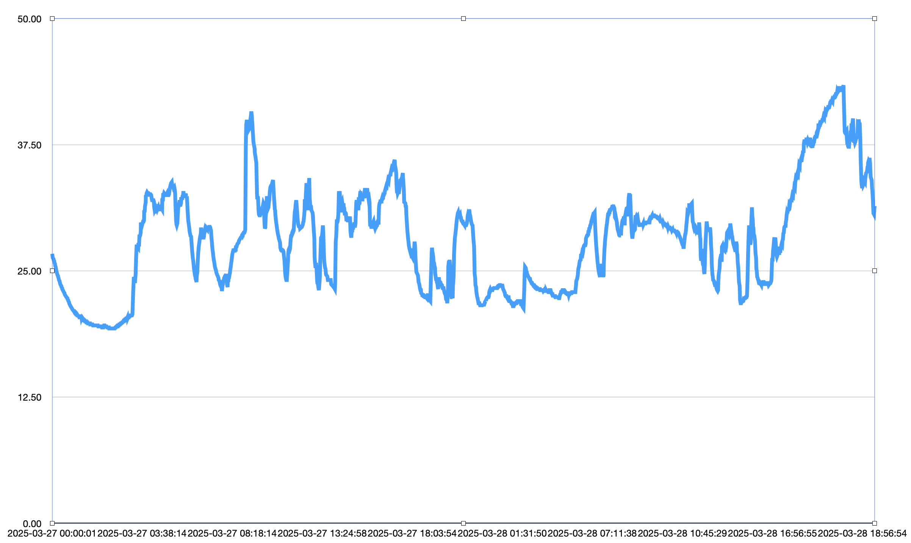

# Docs

## Charging

There are dozens of sensors inside of iPhones. The main ones you're focused on when charging are battery temps, voltage, amperage, and duration (charging/not charging states).

As it stands, within the tarball from a sysdiagnose, there's a plsql (sqlite3) file that you can query to get battery temps, charging state, and estimated (and actual) % of the device's battery. By graphing battery temps over time, you can get something like this (below).

## Utils

Generally speaking, these are generics that we may need for different parts of the library overall. Things like being able to read from different files within the sysdiagnose in-memory from the tarball (without extracting). Being able to push byte array data into an in-memory sqlite database.

# Footnotes

Tbh, I've got more up my sleeve but not enough time to do it all in one all-nighter. Some of this is also reverse engineering for data and logging across the board (for different features/reasons, think Charging/Power, Wireless comms, Siri, Software Updates, and the logarchive/event logging). Please note that I can only operate off of so much functional data. Feel free to ask for things using Issues, but please be respectful of my time and I'll try to be respectful of yours. (Pull Requests are preferred if you have coding experience, or how getting an additional function for exploration within the library will benefit you are preferred as a way to respect each other's time here.)

## Tests

I really want to add tests. See above about time limitations so we'll have to circle back to that with a valid but truncated sysdiagnose for what I'd be content with.
